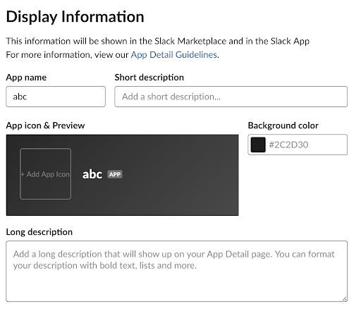
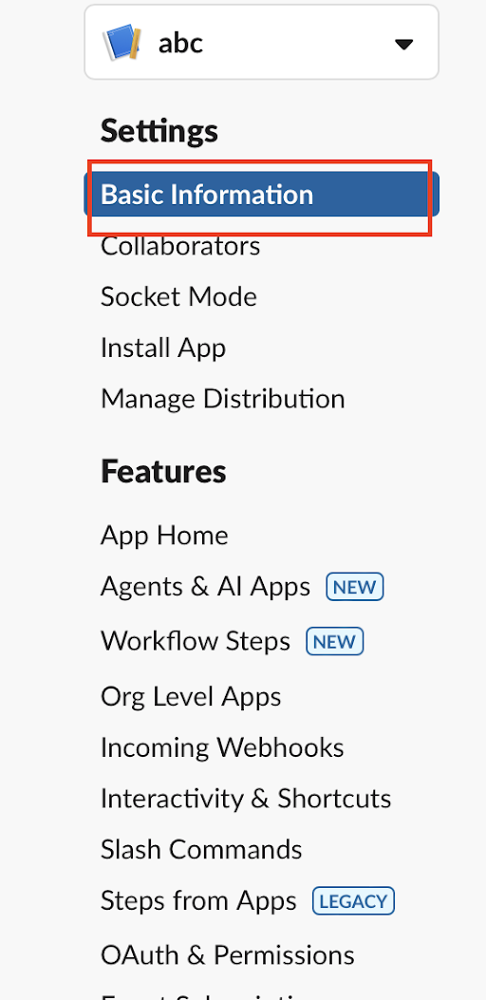
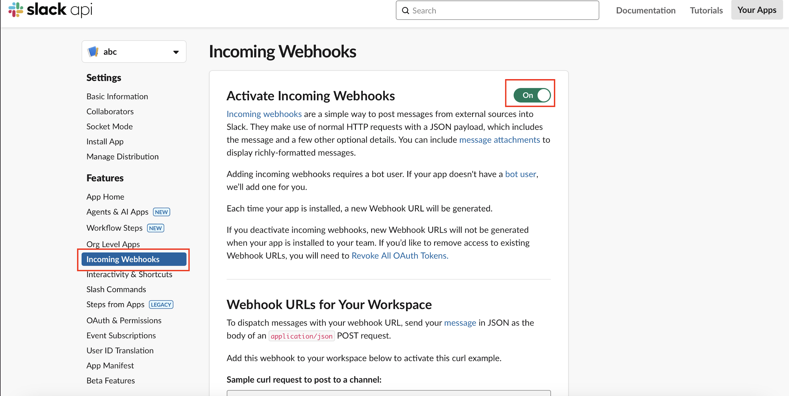
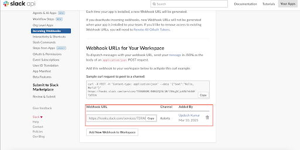
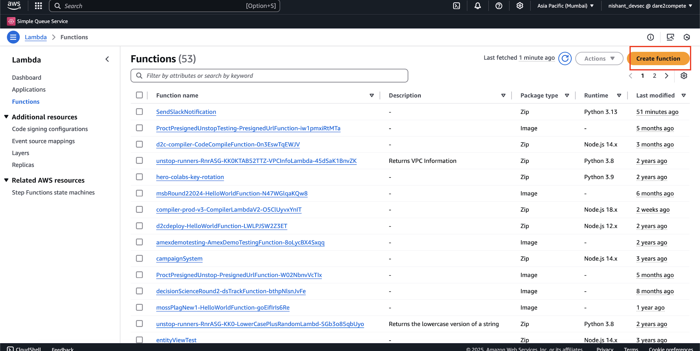

-----------------------------------STEPS----------------------------------------------
1) Steps to Get a Slack Webhook URL for AWS Alarm Notifications
To send AWS CloudWatch alarm notifications to Slack, you need a Slack Incoming Webhook URL. Follow these steps to generate it:

Go to this site : https://api.slack.com/

2) Select Your app 
    https://chat.google.com/u/1/api/get_attachment_url?url_type=FIFE_URL&content_type=image%2Fpng&attachment_token=AOo0EEWpU8d9TBp51tOM4TEMRGalEFAyxlC7uJl2tE8aEmzi2kTaUeDuGsC0em9iN%2FmSodJhMoTj%2FcSSDBl1AMEKdmToC4kUa8pleR3MD7RStkrbikNbc9eHwspMG8Q%2FMj1g4ab1OgXpXQ3yVFnokWrDioS9prj3ykzPe8PhLsR9jmjqj7tmf72kxChI9kPlqBixdDhm93krfu0DzMCr7bKnd8CJKnfLnNAiB7m%2BhfhsKdNkxKnAg%2FT%2FkUYYr99VeHNXVOckSLEPSGnBTnFdzsmcJE%2BvkR6SvPumYGHMFASH3ZpS10%2FTkV1lQRQ4Gr7nf2gwJmJBzWtd%2Fjol93DPBt95%2BO1cEbEkj4GNwDGrU71uCwRckijBTmwA0UPZ65RCxZqhw3MBKThZ0EZGJG0yAlYa2rduRElWXT89iq4WZSAW2OIUdvvS%2Ft0BUBeFbyxWbg8uHBGu1UMJyZNMt1ih7wPNXp0XleJnixf7fumdhWSKg%2Bdr0igiqbyEh59UrxgMIMplryOjTZfwpccTvF0cTTASgaY5vTJ07v8UWD5WzQNBCae1kwh3mOBxe72xyIGuYaymlw%3D%3D&allow_caching=true&sz=w512&authuser=1

    3) Select Create New App 

     https://chat.google.com/u/1/api/get_attachment_url?url_type=FIFE_URL&content_type=image%2Fpng&attachment_token=AOo0EEVdqKqXoyrl5zQxGL4WeSRmWWhqAEDKmvwJ%2Bc5idYxz3Ri%2B5wi90ZuDJSDQPaNdQwt23MaXXTgFj65yG4JwEpI63nNo8MTYDvc7YyDWOHuoSY0Q3BlccEyEfNR9BQZuGPB430SeR12VFjaBBUpXwdCqBQqMPJeIFz53iMptc0QoiZjfNJvpj9G6XdwX4wzCIq8OYfGlJyZdAdLLqX8V4DkiKTK6oRByvcTAPRGSDQ5DwLTyoTEaYIpj8YEXgIbV110Jy7oh6Sq95dq6kEw3xo84Bsl7eW47UbALLLUL8Ghpn0KB%2B17yV1Ffaen3Oj3NFM2aBebE5G7frKHbfstv%2FJQ5%2BTwGeaBS8fxDtmZrN2ScfOYc%2B5RgOlHSiQotyO64PGdSL916pplZBOKcgckX6A98SsfMcVnSlMj6FexyL2proxvge%2FmIeDjjt3gjlfhm8JYHu0gHbkaVjtTMy6b6MzpZfME8MgTBNU3ImGXiCuuM6tdWa%2FXyFSSl27ZgjEsPolR83YZPiv43G5x47n11fmfyERfObKuqUbHMIIquAePY8tTeZRimCL2Uky7cNu4%3D&allow_caching=true&sz=w512&authuser=1
     

     4)Select From Sratch
      
      https://chat.google.com/u/1/api/get_attachment_url?url_type=FIFE_URL&content_type=image%2Fpng&attachment_token=AOo0EEVsjS4nMwPjs%2BCcKqKX1RiWDfpzUeqY6%2FoNqbHLe05vY87oy4uoFcAZij5tftyV6ZCycbLvYFCP%2FcK41%2BPqL%2BIICminO4x9VfagADe21QnUZPcikMh%2BCt1sRRauE%2Br63ExTwn%2BkCrDuc3zwRxi8YP71C%2FnuDOIbRBIuwtQrNUJz1wZ9%2B6%2BXKJ8pSZNIypdi4mrAru7PHiDlyc04RhYO7%2BoaYYtARDIcWg%2B7GRZXROCJZ2CRqekn6RDD3rE%2FuxhvoJ4PIoEuf0Dvgamo7B5AveJ49Z1RcztXYrlsATcXjW1YTjcblS2%2ByYkKOjroi84QpJHY%2BRAYTeF7XKX6l0WE%2FghkJAHCnBqsbfQrvurVxWMCtxBEzLirsrukr%2FchINcm0GaEiW9cgoLJZUpWPM1NsNL4mHNQRALu0fF6fvxynnhgVyYy3l9%2FtncuaxWBDVryOLgSdWWDlNdiBuRJiIUIlUjueMbNNvc6oS0I4ArVeNn%2BmtGuwoOJ%2FEKne6vME1CGsU4W8EkIH%2FbfOTprDuguJu2p8qQtjZ9uGAiX0pE8t%2FJx85LM3VcTzql7uRBP7AA%3D&allow_caching=true&sz=w512&authuser=1

      5) Give the App Name as per ur choice and Select ur Slack Workspace and Create App

              
            
    6) Go to Basic Information Section and add information for ur slack (Not Important)
      
      

    7) Go to Incoming Webhook setting and On Activate Incoming Webhooks

     

    8) Create NewWebhook to Workspace

     https://chat.google.com/u/1/api/get_attachment_url?url_type=FIFE_URL&content_type=image%2Fpng&attachment_token=AOo0EEWPUrVBQa6zuPsar7rqf5bJT9X7O%2ByMbvcf8%2BuQHqDd7iuRsPfm8eGop9yIwk3u059jwY%2BiInacAl7NXsHJ8hjWSGItKYw%2F5IBHPtJQ76g61OpFbOZLzR%2B34oSN6LR2Rj5OwHvIwC8POtetv7cYpjpksn8tIDX1uDMe3MovtZCjO%2Bs%2BwrXNyhCz6zn2i9hPNI%2FXcdya11OPjCvStF000YSFWCQ3pJvoD9uOq8eJy4MLk5osypJ7lVwrmN71LbRPWLMJkK5Ny2eA%2BpTrRrDLapAZeIsxdF9Dxw8ahj%2BX4WXV6yK3a%2BnHfpJS7XvjUdr7k0wL9SPsUA%2FuphhtKX%2FyxIhULbLXKzU8xNsK9ChAeGL0gV5%2FoBe2IMX4LdN3eJpY2sukotyHhD7LivP3t3JauP3rFlfmTyIYtCllha05VXnatBys9tK97GCwoZfAPlk6sWYBUyZMsh5534TDGOB2hWrapMG1zc4ttik%2FwpR4PMFvhAymn3JHez3N6ZHkDDdHOfY5ayoJLpSuZwSB7wQzkmBfUuAgLEL2P4VyFOSXTME6e2UdwPAh%2B9%2Fd8eQxTAOb&allow_caching=true&authuser=1&sz=w2880-h1800

     9) Select the Slack Channel, Where alarm message will go

     https://chat.google.com/u/1/api/get_attachment_url?url_type=FIFE_URL&content_type=image%2Fpng&attachment_token=AOo0EEVh7r24DOrRhK3XHPL83E0q7A1qAPEQLBhmbBe20fMjUBpf0DUfszW6rY5uTSC27bs%2F%2BCQiwTvkK80%2F5c6xMs0dpPV4wTm6K5Dd2sHIyNlypLW%2Bf4YdgHkSujr4HWhhgQPbszi%2FHC3W8X0Caz3nIC36sJ1ndUkFJ2kySOYDHvr0FBHT2nRDothHYyaOwu5eLYPqSr3cL7SQf4vHFx2u7DgG8KwtyFq38NJH0uLGfcJS7dn1xDR3y9NK%2F8j9VQ735Bt4ZZiXHDOvsiYbUPegHy2g6Rh0fJhXAbNMy8d3XOUnb4Fn8I65zu7kmMVpkz0A1oHDQoWQFSMINdO5DXH3pjiYtjfWy5kdr4I%2FtixVJUS8Oem04Iah1wjyfsIydXgDsXk4E46PcpPZohtEKrlj%2F4jrHumzNjDIEv3902g2BmkiHuU3ePzrkms8GNy%2B8J5rK3CbBP43SwP7Bb6nRmQnYC3qjIe1AUEmcDvidlphbYnEynO000RlynGqaKywXh6CBF8n%2BRZVjs7p9GTz2LnKqw2WhCS5DjupJH%2Fuz82gnL0ORuy4N2cH6fM%2Bb8POiQ%3D%3D&allow_caching=true&sz=w512&authuser=1

     10) Copy the Webhook URL and Create Aws secrets with key (webhook_url) and value( Webhook URL)

     

    11) Go to AWS Lambda and Create Function(SendSlackNotification)

    
    
    12) Add the Automation Code and Deploy , 

    13)  Add a trigger for Alarm with Sns Topic --
  https://chat.google.com/u/1/api/get_attachment_url?url_type=FIFE_URL&content_type=image%2Fpng&attachment_token=AOo0EEWFhhFK7FtGClXzRDnVSmnRV11J2wwpj9iB08%2BHr8Nf%2BzciPVlJTxV3ZzuBFH%2BtVizBkawWoXgVhkp8RmG8LXK3au8sJHY95dOE3%2BPHDUzHvAqBXcOz0dZmZd1XN38%2Fl91j4zZAXK7bZYGMK5cjvZk5jUAd%2BBWAkcHcc3LDq3CT%2BwJlAJTCP11rLEvTHXWv%2FmWkOuX7x3jpU3J9TVwme9h4S4GW9GhhCNVMyPnPcmE1f%2Bw5GnVqgOZRcJj4EUzxIV9uBNLpZpMDJ38zUIC6BhywFx7GsCKtqNPa2xrXWDceU7Q7mA9KKvMfcSvZYiyBcwINlAsumhwVyBLtknZH3IbD8hmXswr9YgflNfx8he%2FyMQcc4rPkj7sWMsEH2%2Bwf16bOKAuRz%2FUCKLeVDrYHSHn6Zc6IS9W3HE%2F9vYGxBCR4d7dznzPHnGJgyvtFicBbdA9XC8r47Hs7ezT6zPwTFkIBYqdJpSHSG39CEs%2BQcpjun8We18vLPosvQ7Tl8noQlNqrVBoolK1NGZM9xttNUZCvhfYGJlNWxdn%2BzYlpN6guBl0gMn37YO74JwWwMd86&allow_caching=true&sz=w512&authuser=1

  Go to Add trigger -- search SNS then ur topic

14) For Testing ---
       Click Test and Use the following sample SNS event to test manually:
       {
  "Records": [
    {
      "Sns": {
        "Message": "{\"AlarmName\": \"TestAlarm\", \"NewStateValue\": \"ALARM\", \"NewStateReason\": \"Threshold Crossed\"}"
      }
    }
  ]
}
 15)  Click "Invoke".
If the message appears in Slack → SNS is not triggering Lambda correctly.

If the message does not appear in Slack → The issue is in Lambda code or permissions.

16) Attached Persmison if not added -----
Step 1: Attach Required Permissions to Lambda Role
Go to AWS IAM Console.
Click Roles → Find your Lambda function role:
Click Add permissions → Attach policies.
Search for SecretsManagerReadWrite and select it.
Click Attach policy.
Step 2: Add a Custom Inline Policy
Go to IAM → Roles.
Find SendSlackNotification-role-7zcwa300.
Click Add Permissions → Create Inline Policy.
Choose JSON and paste the following policy:

{
    "Version": "2012-10-17",
    "Statement": [
        {
            "Effect": "Allow",
            "Action": "secretsmanager:GetSecretValue",
            "Resource": "arn:aws:secretsmanager:ap-south-1:543674804720:secret:SlackWebhookURL-*"
        }
    ]
}

17) Step 3: Test Lambda Again
Go to AWS Lambda Console.
Click Test → Use this sample event:
{
  "Records": [
    {
      "Sns": {
        "Message": "{\"AlarmName\": \"TestAlarm\", \"NewStateValue\": \"ALARM\", \"NewStateReason\": \"Threshold Crossed\"}"
      }
    }
  ]
}

Click Invoke.

19) Sample Event For Testing ----- 
   {
  "Records": [
    {
      "EventSource": "aws:sns",
      "EventVersion": "1.0",
      "EventSubscriptionArn": "arn:aws:sns:ap-south-1:123456789012:CloudWatchAlarms:abcdefg",
      "Sns": {
        "MessageId": "12345-67890",
        "Type": "Notification",
        "TopicArn": "arn:aws:sns:ap-south-1:123456789012:CloudWatchAlarms",
        "Subject": "ALARM: \"URGENT: Database High Capacity Usage : Alert Level 2\" in AP-SOUTH-1",
        "Message": "{\"AlarmName\":\"URGENT: Database High Capacity Usage : Alert Level 2\",\"AlarmDescription\":\"This alarm monitors database usage.\",\"AWSAccountId\":\"123456789012\",\"NewStateValue\":\"ALARM\",\"OldStateValue\":\"OK\",\"NewStateReason\":\"Threshold Crossed: 90.5% usage.\",\"StateChangeTime\":\"2025-03-12T06:30:00.000Z\",\"Region\":\"ap-south-1\",\"Trigger\":{\"MetricName\":\"CPUUtilization\",\"Namespace\":\"AWS/EC2\",\"StatisticType\":\"Statistic\",\"Statistic\":\"AVERAGE\",\"Unit\":\"Percent\",\"Dimensions\":[{\"name\":\"InstanceId\",\"value\":\"i-0abcdef1234567890\"}],\"Period\":300,\"EvaluationPeriods\":1,\"ComparisonOperator\":\"GreaterThanThreshold\",\"Threshold\":80.0}}",
        "Timestamp": "2025-03-12T06:30:00.000Z",
        "SignatureVersion": "1",
        "Signature": "EXAMPLE_SIGNATURE",
        "SigningCertUrl": "https://sns.ap-south-1.amazonaws.com/SimpleNotificationService-xxxxxxxxxxxx.pem",
        "UnsubscribeUrl": "https://sns.ap-south-1.amazonaws.com/?Action=Unsubscribe&SubscriptionArn=arn:aws:sns:ap-south-1:123456789012:CloudWatchAlarms:abcdefg",
        "MessageAttributes": {}
      }
    }
  ]
}
